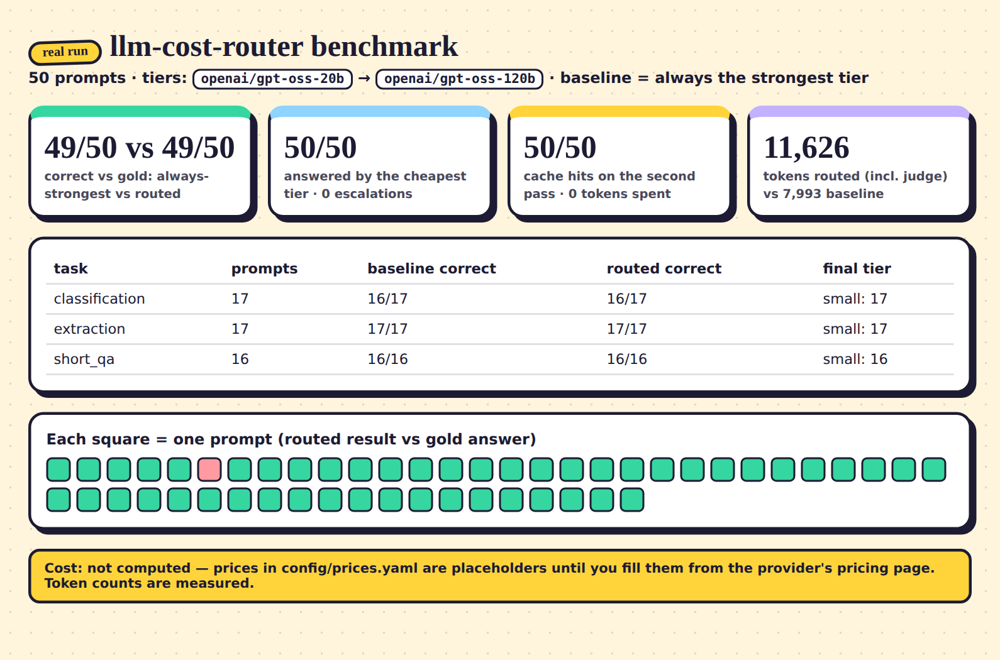

# llm-cost-router

Sends each prompt to the **cheapest model that passes a quality check**, escalates to a stronger model only when the check fails, **caches repeats**, and logs the cost of every request. Providers are anything OpenAI-compatible (Groq, NVIDIA API Catalog, OpenRouter free models…) — the same `openai` client with a different `base_url`.



*Real output of `python -m router bench` against Groq (two tiers: `openai/gpt-oss-20b` → `openai/gpt-oss-120b`). Dollar costs are deliberately blank — see [Prices](#prices-and-the-no-made-up-numbers-rule).*

## Quickstart

```bash
pip install -r requirements.txt
cp .env.example .env && export GROQ_API_KEY=...        # free key from console.groq.com
python -m router check-models                          # confirms the tier model ids exist for your key
python -m router complete "Classify as positive, negative or neutral: 'Loved it'" --task classification
```

Also: `python -m router bench` (the 50-prompt benchmark), `python -m router stats` (usage log summary), and an HTTP API:

```bash
uvicorn --factory router.api:get_app --port 8000
curl -s localhost:8000/complete -H 'content-type: application/json' \
  -d '{"prompt": "What is the capital city of Australia?", "task_type": "short_qa"}'
```

## How routing works

```
prompt ──► cache? ──hit──► answer (cost 0)
             │ miss
             ▼
        tier 1 (cheapest) ──► quality check ──pass──► cache + answer
             │ fail / provider error
             ▼
        tier 2 ... last tier (strongest) ──► answer (cached only if it passed)
```

- **Tiers** live in `config/tiers.yaml`, cheapest first. The last tier is the strongest: it is the escalation ceiling, the LLM judge and the benchmark baseline.
- **Quality checks** are chosen per task type in `config/tasks.yaml`:

  | check | passes when | used for |
  |---|---|---|
  | `exact` | the normalised answer equals one of the task's `allowed` outputs (or the request's own `expected`) | classification |
  | `json_schema` | the answer is valid JSON (a ```` ```json ```` fence is tolerated) and validates against the task's schema | structured extraction |
  | `judge` | the strongest tier grades the answer against the task's rubric. An unreadable verdict counts as a **fail**. If the strongest tier produced the answer there is nobody above it to escalate to, so it is accepted without self-judging | short Q&A |

- **Cache**: SQLite, keyed by `sha256(task type + normalised prompt)` (Unicode NFKC + collapsed whitespace; case is kept because it can change meaning). A hit makes no API call and costs 0. Only answers that **passed** their check are cached, so a bad answer is never replayed.
- **Usage log**: every request (hits included) is written to SQLite with tier path, tokens, cost and latency; `GET /usage` / `python -m router stats` summarise it.
- A provider error on a tier (rate limit, outage, bad model id) counts as a failure of that tier and escalates.

## Prices and the "no made-up numbers" rule

`config/prices.yaml` ships with **`null` placeholders** and the comment "fill from the provider's pricing page". This project never estimates a price:

- A request that used a model with a missing price reports `cost: null` plus a note telling you which file to fill in — tokens are still measured. With `--strict-costs` / `STRICT_COSTS=1` it raises `MissingPriceError` instead.
- Free tiers are real prices: write `0.0` explicitly.
- The benchmark only reports dollar savings when every price it needs is filled in, computed from the token counts it measured.

## The benchmark — and what the sample shows (and doesn't)

`benchmark/prompts.jsonl` holds 50 prompts with gold answers (17 classification, 17 extraction to JSON, 16 short factual Q&A). `python -m router bench` runs the strongest tier alone, then the router with a cold cache, then the router again (warm cache), and writes `report.md` / `report.json`. The committed [`docs/sample-report.md`](docs/sample-report.md) is **example output from one real run** (Groq only):

- Pass rate vs the gold answers: 49/50 for both always-strongest and routed. The one miss is the same classification prompt in both modes.
- **No prompt was escalated** — all 50 were answered and accepted by the cheap tier. So this run says nothing about how often escalation happens on harder workloads; escalation is covered by the mocked-provider tests instead.
- **Routed used more tokens than the baseline** here (11,626 vs 7,993), because the 16 Q&A prompts each paid for an extra judge call on the strong model and nothing was escalated to save. Whether routing is cheaper in dollars depends on the tier price gap and the escalation rate, so the sample report leaves cost blank until you add real prices.
- Second pass: 50/50 cache hits, 0 tokens.
- Gold answers are mine and a few were ambiguous at first; I tightened the wording of three extraction prompts before the final run (the dataset in the repo is the one the sample used).

Your numbers will differ with your tiers, prices and prompts — run it on your own prompts.

## Configuration

| file | what |
|---|---|
| `config/tiers.yaml` | providers (`base_url`, key env var), tiers cheapest-first, optional per-tier `params` sent as `extra_body` (e.g. `reasoning_effort`) |
| `config/prices.yaml` | USD per million input/output tokens per `provider/model` — placeholders |
| `config/tasks.yaml` | per task type: system prompt, `max_tokens`, check and its allowed set / schema / rubric |

Providers: Groq `https://api.groq.com/openai/v1`, NVIDIA `https://integrate.api.nvidia.com/v1`, OpenRouter `https://openrouter.ai/api/v1`. To mix providers, add tiers (an OpenRouter/NVIDIA example is commented in `tiers.yaml`) and run `python -m router check-models`.

## Tests

```bash
pip install -r requirements-dev.txt && pytest
```

46 tests with **mocked providers** (no network): escalation on a failed check (exact, JSON schema, judge), judge failing closed, cache hits making zero provider calls, cache key normalisation, cost arithmetic, missing price raising a clear error, failed attempts and judge calls being billed, API behaviour, gold scoring.

## What was and wasn't verified

- Live runs and the benchmark used **Groq only**, with the two tiers above; `check-models` confirmed both model ids exist for the key used.
- **NVIDIA and OpenRouter were not reachable from the environment this was built in**, so those providers' base URLs and model ids have not been exercised live here. Run `python -m router check-models` with your keys before relying on them.
- The Docker image was not built here.
- Model catalogs change: the Llama 3.x chat models that older tutorials use were no longer on Groq's list when this was written — hence the `gpt-oss` defaults.
